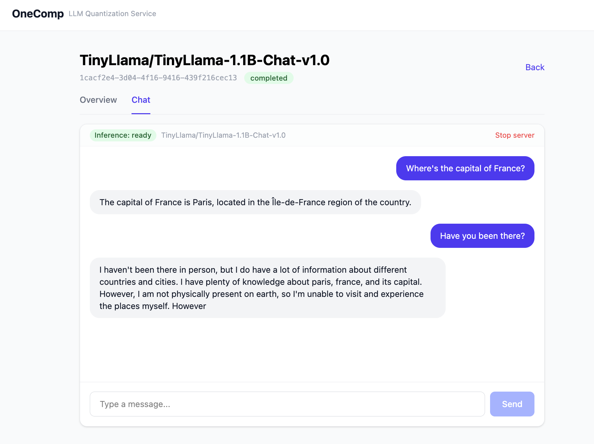

# OneComp Web App

LLM quantization dashboard built on top of
[OneCompression](https://github.com/FujitsuResearch/OneCompression).
Pick a Hugging Face model and quantization parameters from the browser,
run quantization on the GPU, and verify the result with an inference chat.



This repository targets **SLURM-managed HPC clusters (GPU nodes) running
without Docker**. PostgreSQL / MinIO are replaced with SQLite and local file
storage, and Redis is built from source in user space.

---

## Architecture (HPC)

```
Local PC                       Login node                 GPU node (salloc target)
┌─────────────┐   SSH tunnel   ┌──────────┐              ┌──────────────────────────┐
│ Vite (yarn) │ ──────────────►│ login    │ ── srun ──►  │ FastAPI  (:8001)         │
│  :5173      │   LocalForward │          │              │ Celery worker (solo)     │
└─────────────┘   → gpuXX:8001 └──────────┘              │ Redis     (127.0.0.1)    │
                                                         │ vLLM      (:8090)        │
                                                         │ SQLite + tmp/quantized/  │
                                                         └──────────────────────────┘
```

| Component | Stack | Notes (HPC) |
|---|---|---|
| Frontend | React, TypeScript, Vite, TanStack Query | Runs on the local PC; API accessed through an SSH tunnel |
| Backend API | FastAPI, SQLAlchemy | `start_backend.py` on the GPU node |
| Task Queue | Celery + Redis | Worker also on the GPU node; Redis built from source |
| Database | **SQLite** (`backend/onecomp.db`) | The file can live on lustre |
| Quantization output | **Local directory** (`backend/tmp/quantized/`) | Saved per job ID |
| Quantization | OneCompression (`onecomp`) | `ONECOMP_DEVICE=cuda` |
| Inference (CUDA) | vLLM (separate process) | Spawned from the Python in the main `.venv` |

Quantization and vLLM share **the same Python environment** (`backend/.venv`).
`onecomp` and `vllm` are resolved together by `pyproject.toml`
(PyTorch for CUDA 13.0 via `pytorch-cu130`).

---

## Prerequisites

| Item | Example |
|---|---|
| Job scheduler | SLURM (`salloc` / `srun`) |
| Python | 3.12 |
| Package manager | [uv](https://docs.astral.sh/uv/) |
| GPU | NVIDIA (CUDA 12.x / 13.x driver) |
| Frontend (local) | Node.js + Yarn |

---

## Quick start

See [docs/setup-hpc.md](docs/setup-hpc.md) for details and troubleshooting.

### 1. First-time setup (login node or GPU node)

When the node has network access, run `uv sync` on the **GPU node** you will
use for jobs (recommended). Prebuilt wheels often work from the login node,
but native builds, glibc, and the CUDA driver/runtime can differ between
login and compute nodes.

```bash
cd backend/
uv sync
```

If you ran `uv sync` on the login node, check on the **GPU node** (after
step 2) before quantizing:

```bash
cd backend/ && . .venv/bin/activate
python -c "import torch; print('cuda:', torch.cuda.is_available())"
```

Redis (often `apt install` is not available on HPC):

```bash
cd backend/
wget https://github.com/redis/redis/archive/refs/tags/7.2.7.tar.gz
tar xzf 7.2.7.tar.gz
cd redis-7.2.7 && make -j$(nproc) && cd ..
```

### 2. Allocate a GPU node

Pick a GPU partition with `sinfo` (name varies by site; e.g. `interactive`,
`gpu`):

```bash
salloc -p <partition> --time=04:00:00 --gres=gpu:1
```

All commands below run **on the GPU node**.

### 3. Start the services (GPU node)

**Terminal A** — Redis + Worker:

```bash
cd backend/
export LC_ALL=C
mkdir -p tmp/redis
./redis-7.2.7/src/redis-server \
  --daemonize yes \
  --bind 127.0.0.1 \
  --dir "$(pwd)/tmp/redis" \
  --pidfile "$(pwd)/tmp/redis/redis.pid" \
  --logfile "$(pwd)/tmp/redis/redis.log"
./redis-7.2.7/src/redis-cli -h 127.0.0.1 ping   # → PONG

. .venv/bin/activate
export ONECOMP_DEVICE=cuda
# Local model root — required on worker **and** API when using short local names
# instead of a Hugging Face repo id. See Environment variables.
export LOCAL_MODEL_ROOT="$(pwd)/models"
# Required on nodes without nvcc (CUDA toolkit); see Environment variables below
export VLLM_USE_FLASHINFER_SAMPLER=0
nohup uv run python start_worker.py > /tmp/worker.log 2>&1 &
```

**Terminal B** — API (second shell on the same GPU node; from the **login
node**, [setup-hpc.md §2.5](docs/setup-hpc.md#25-two-terminals-on-the-same-salloc-job)):

```bash
squeue -u $USER                    # find the JOBID (e.g. 41229)
srun --jobid=41229 --pty bash      # replace 41229 with your JOBID
cd backend/
. .venv/bin/activate
export ONECOMP_DEVICE=cuda
export LOCAL_MODEL_ROOT="$(pwd)/models"
uv run python start_backend.py --reload --port 8001
```

Connectivity check on the same node:

```bash
curl http://127.0.0.1:8001/api/health
# {"status":"ok"}
```

### 4. Use the UI from your local PC

Steps **4a–4d** all run on your **local PC**. Step 3 left the API on the
**GPU node**; the SSH tunnel in **4c** forwards `localhost:8001` on your PC
to that API. See [setup-hpc.md §2.6](docs/setup-hpc.md#26-access-from-a-local-pc-ssh-tunnel)
/ [§2.7](docs/setup-hpc.md#27-frontend).

**4a. Prepare the frontend** (one-time per clone; local PC):

```bash
# clone the repo on your PC, then:
cd frontend/
npm install    # or: yarn — Node.js required; see setup-hpc §2.7
```

**4b. SSH config** (local PC) — point `LocalForward` at the GPU node name
(it changes every `salloc`):

```
Host my-hpc-login
    HostName <login-node>
    LocalForward 8001 <gpu-node>:8001
    ServerAliveInterval 60
```

`LocalForward` alone does not open a tunnel; **4c** is still required.

**4c. Open the tunnel** (local PC; leave this terminal open):

```bash
ssh my-hpc-login -N
```

With step 3 already running on the GPU node, check from the local PC:
`curl http://localhost:8001/api/health` → `{"status":"ok"}`.

**4d. Start Vite** (local PC; another terminal):

```bash
cd frontend/
VITE_API_TARGET=http://localhost:8001 yarn dev
```

Browser: http://localhost:5173

### 5. Shut down

**On your local PC** (steps **4d** / **4c**):

- Stop the frontend: `Ctrl+C` in the terminal running `yarn dev` / `npm run dev`
- Close the SSH tunnel: `Ctrl+C` in the terminal running `ssh my-hpc-login -N`

**On the cluster** — end the SLURM allocation: `exit` from the `salloc`
shell, or `scancel <jobid>`. That stops Redis, the worker, the API, and vLLM
on the GPU node.

**Keep the allocation, restart services only** — e.g. after changing env
vars or `config.py`, stop processes on the GPU node and run step **3**
again. See [setup-hpc.md §2.9](docs/setup-hpc.md#29-stopping-processes):

```bash
pkill -f start_worker.py
pkill -f vllm.entrypoints
```

---

## Typical workflow

1. **New Job** — pick a Hugging Face model and a method (`gptq`, `autobit`, `jointq`, or `auto_run`). QEP is optional (default on; not supported with JointQ). Fractional bit widths are allowed for `autobit` / `auto_run`; `auto_run` sets bits and group size from VRAM automatically.
2. **Quantize** — wait until the job completes. Output is saved under `tmp/quantized/<job-id>/`.
3. **Deploy** — start vLLM (`ONECOMP_DEVICE=cuda` required).
4. **Chat** — test inference in the browser. On failure, check `error_message` on the job detail page.

| State | Chat behavior |
|---|---|
| vLLM deploy succeeded (`inference_url` set) | `POST /chat` returns immediately |
| vLLM not deployed / failed | Falls back to polling `chat-result` (slow) |

Deploy / chat logs:

```bash
tail -f /tmp/worker.log
tail -80 /tmp/vllm-<job-id>.log    # when vLLM fails
```

---

## Environment variables

`ONECOMP_*` settings default in `backend/app/core/config.py`. Other variables
below are read directly from the process environment.

### `LOCAL_MODEL_ROOT` (local model directory)

Set this **before starting both the Celery worker and the API** when jobs use
short local directory names (e.g. `gemma-2-2b-it`) rather than a Hugging Face
repo id (`org/model`). The server maps `model_name` to
`{LOCAL_MODEL_ROOT}/<model_name>` for job validation and quantization.

| Variable | Default | Description |
|---|---|---|
| `LOCAL_MODEL_ROOT` | `/models` | Root directory of pre-downloaded models on shared storage |

Example (run from `backend/`; models live in `backend/models/`):

```bash
export LOCAL_MODEL_ROOT="$(pwd)/models"
```

Use the **same value** in Terminal A (worker) and Terminal B (API). If only
one process has it, jobs may pass validation but fail during quantization with
“not a local folder” / Hugging Face Hub errors.

After changing `LOCAL_MODEL_ROOT`, restart **both** processes (step **3**).

### `ONECOMP_*` (application settings)

| Variable | Default (HPC) | Description |
|---|---|---|
| `ONECOMP_DATABASE_URL` | `sqlite:///./onecomp.db` | DB (path relative to `backend/`) |
| `ONECOMP_REDIS_URL` | `redis://127.0.0.1:6379/0` | Redis (**`127.0.0.1` required**; `localhost` may fail over IPv6) |
| `ONECOMP_DEVICE` | `cpu` | **Set to `cuda`** (both worker and API) |
| `ONECOMP_QUANTIZED_DIR` | `tmp/quantized` | Where quantized models are stored |
| `ONECOMP_VLLM_PYTHON` | `.venv/bin/python` | Python used to launch vLLM. Use `.venv-vllm/bin/python` when separated ([§1.2.1](docs/setup-hpc.md#121-separate-vllm-python-venv-optional)) |
| `ONECOMP_VLLM_PORT` | `8090` | vLLM port |
| `ONECOMP_MOCK_QUANTIZATION` | `false` | Set to `true` to skip quantization (pipeline smoke test) |
| `ONECOMP_CHAT_TIMEOUT` | `900` | Chat HTTP timeout in seconds |
| `VLLM_USE_FLASHINFER_SAMPLER` | (vLLM default) | Set to `0` on the **Celery worker** when `nvcc` is missing (see below) |

### vLLM deploy without `nvcc` (HPC)

Quantization (`ONECOMP_DEVICE=cuda`) only needs the CUDA driver/runtime.
**Chat deploy** starts vLLM, which may enable the FlashInfer sampler and
trigger a JIT build that requires `nvcc`. On many HPC GPU nodes the driver
works but the CUDA toolkit is not installed.

| Symptom | `error_message` contains `Could not find nvcc` |
|---|---|
| Fix | `export VLLM_USE_FLASHINFER_SAMPLER=0` **before** starting the worker |
| Where | **Worker only** — the API does not spawn vLLM; setting this on the API alone has no effect |
| After change | `pkill -f start_worker.py` and restart the worker, then **Stop → Deploy** in the UI |

```bash
pkill -f start_worker.py
cd backend && . .venv/bin/activate
export ONECOMP_DEVICE=cuda
export LOCAL_MODEL_ROOT="$(pwd)/models"
export VLLM_USE_FLASHINFER_SAMPLER=0
nohup uv run python start_worker.py > /tmp/worker.log 2>&1 &
```

See [setup-hpc.md #10](docs/setup-hpc.md#10-vllm-deploy-fails--could-not-find-nvcc).

After editing `config.py`, **restart the Celery worker**. The API's `--reload`
does not propagate to the worker.

```bash
pkill -f start_worker.py
cd backend && . .venv/bin/activate
export ONECOMP_DEVICE=cuda
export LOCAL_MODEL_ROOT="$(pwd)/models"
nohup uv run python start_worker.py > /tmp/worker.log 2>&1 &
```

---

## Directory layout

```
dashboard/
├── backend/
│   ├── app/              # FastAPI, Celery tasks, inference
│   ├── start_backend.py
│   ├── start_worker.py
│   ├── pyproject.toml    # onecomp + vllm + torch (cu130)
│   ├── onecomp.db        # SQLite (created at runtime)
│   └── tmp/quantized/    # Quantization output (gitignored)
├── frontend/             # React SPA
└── docs/
    └── setup-hpc.md      # HPC procedure, architecture, troubleshooting
```

---

## Troubleshooting

See [troubleshooting in docs/setup-hpc.md](docs/setup-hpc.md#5-troubleshooting) for details.

| Symptom | Fix |
|---|---|
| Redis won't start (`Failed to configure LOCALE`) | `export LC_ALL=C` before `redis-server` ([#1b](docs/setup-hpc.md#1b-redis-exits-immediately--invalid-locale)) |
| Redis `Error 97` / Celery reconnect failure | Use `127.0.0.1` in the Redis URL and `--bind` |
| vLLM `/health` returns Squid 403 | `no_proxy` (set automatically in code) |
| Deploy fails because `vllm_python` path is missing | Align `config` with the venv layout and restart the worker (#7) |
| `onecomp` / `vllm` dependency conflict | Separated venv + `vllm_python` in `config.py` |
| SSH tunnel established but API unreachable | Point `LocalForward` at the GPU node name |
| Chat is slow / keeps polling | `ONECOMP_DEVICE=cuda`, then Stop → Deploy |
| Deploy fails: `Could not find nvcc` | `VLLM_USE_FLASHINFER_SAMPLER=0` on the **worker**, restart worker, Stop → Deploy ([#10](docs/setup-hpc.md#10-vllm-deploy-fails--could-not-find-nvcc)) |
| Local model name fails / “not a local folder” on HF | Set the same `LOCAL_MODEL_ROOT` on **worker and API**, restart both; model dir must be `{LOCAL_MODEL_ROOT}/<name>/` ([#11](docs/setup-hpc.md#11-local-model-name-fails--not-a-local-folder-on-hugging-face)) |

### Separating the vLLM venv

**Background (why a separated venv used to exist / why it usually is not needed now)**

The original HPC layout used **two Python environments**, one for quantization
(`onecomp`) and one for inference (vLLM): `backend/.venv` and
`backend/.venv-vllm`. Reasons at the time:

- `onecomp` required `transformers` 5.x
- vLLM **0.19.x** still required `transformers` 4.x, so `uv sync` could not
  resolve both in the same venv
- The worker therefore quantized in the main venv and launched vLLM as a
  **separate process** via `settings.vllm_python` (previously defaulting to
  `.venv-vllm/bin/python`)

Since [OneCompression v1.1.1](https://github.com/FujitsuResearch/OneCompression),
vLLM **0.21.x and later** are supported together, so the dependency tension is
gone. The `pyproject.toml` in this repo resolves `onecomp` and
`vllm>=0.21.0` in the same venv.

For **normal operation** the main `backend/.venv` is enough, and the default
in `config.py` is:

```python
vllm_python: str = ".venv/bin/python"
```

(vLLM is still launched as a subprocess from Celery. What is unified is the
interpreter and packages; the processes remain separate.)

If you do need a **dedicated vLLM venv** (dependency conflict, different
CUDA build, etc.):

1. Create `.venv-vllm/` with `cd backend && bash setup_vllm.sh`
2. Either edit `backend/app/core/config.py` or set the env var when starting the worker:

```python
# config.py (backend/app/core/config.py)
vllm_python: str = ".venv-vllm/bin/python"
```

```bash
export ONECOMP_VLLM_PYTHON="$(pwd)/.venv-vllm/bin/python"   # if you do not want to edit config.py
```

3. **Always** `pkill -f start_worker.py`, restart the worker, then Stop → Deploy from the UI

See [setup-hpc.md §1.2.1 / #9](docs/setup-hpc.md#121-separate-vllm-python-venv-optional)
for the full procedure.

---

## License

See [FujitsuResearch/OneCompression](https://github.com/FujitsuResearch/OneCompression) for the OneCompression license.
